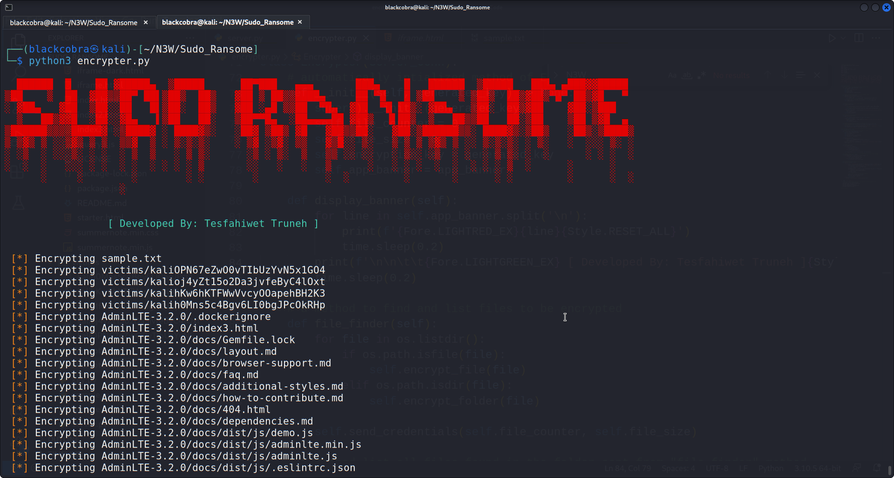
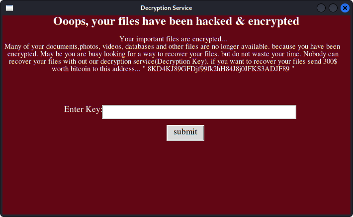
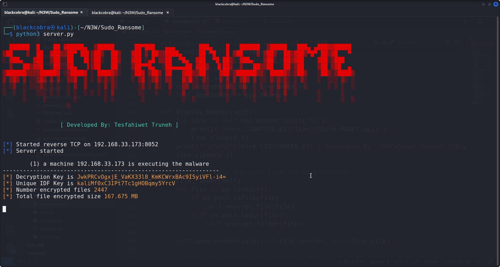

 &nbsp Tesfahiwet Truneh
 
&nbsp Script Developer & Cyber Security geek

 

> Disclaimer: This ransomeware tool should only be used in the lawful, remote encryption of unauthorized systems and files.
> illegal

* `Sudo-Ransome` is a Ransomware software that encrypts the files of a system and
decrypts only after a sum of money is paid to the attacker.
Encryption is the process of encoding information so only authorized parties can
access it.

* The tool uses `TCP(Transmisiion Control Protocol) Socket connection` to send decryption key and victim's information to attacker's server.

* Once rasnome code is installed on the target machine. it will try to connect to the host server based on the `server IP and Port`

# Screenshot Showcase

## 1. Encryption process

## 2. Decryption GUI view

## 3. Attacker Server view

